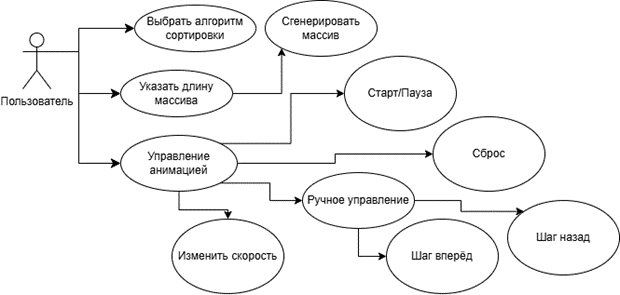
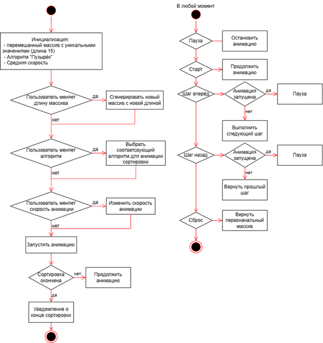
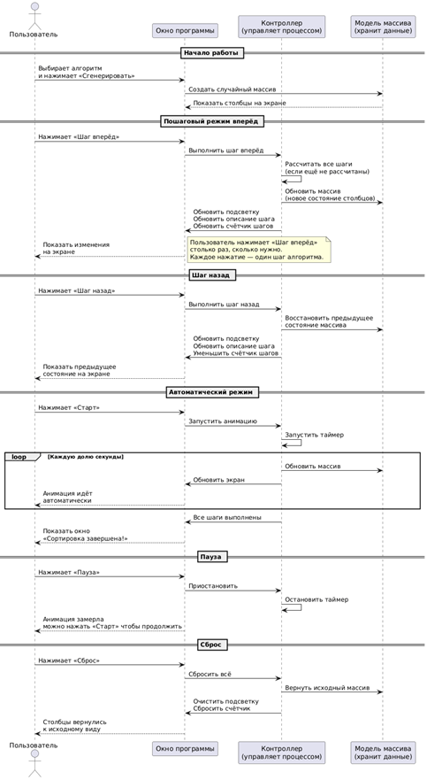
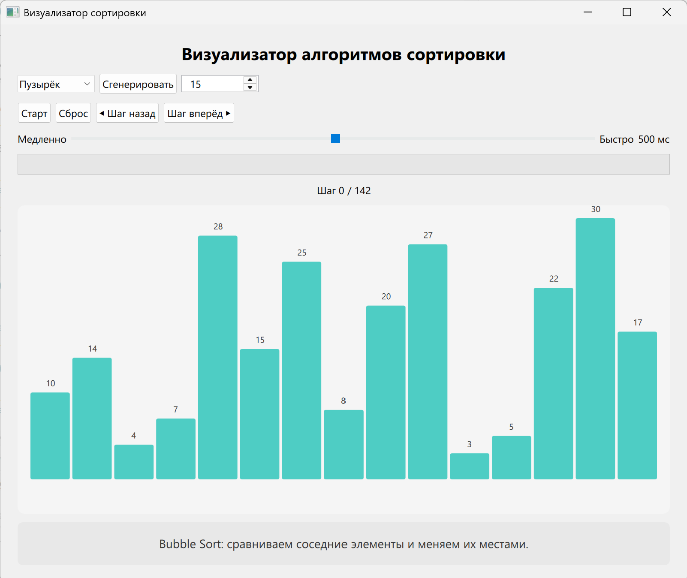
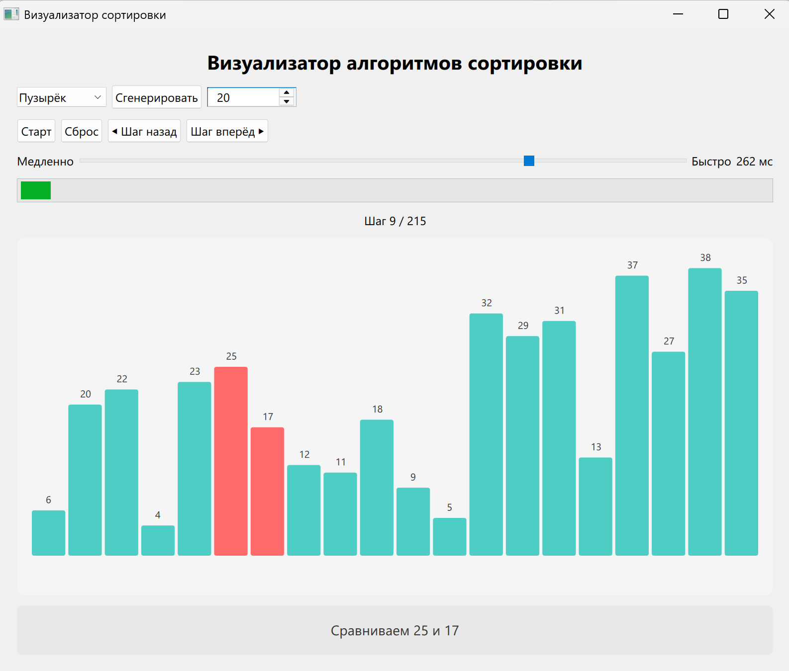
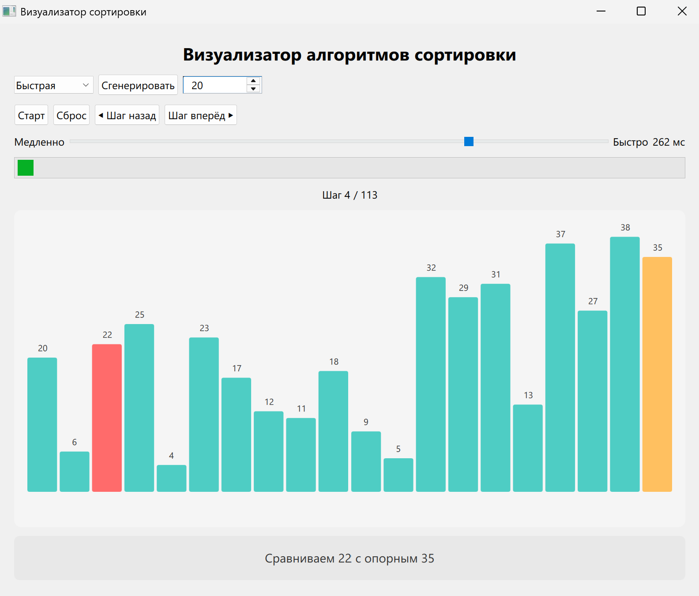

# Sort Visualizer

**Визуализатор алгоритмов сортировки**

---

## Описание проекта

Продукт **«Визуализатор алгоритмов сортировки»**. Инструмент для обучения и демонстрации принципов работы классических алгоритмов сортировки. Приложение генерирует массив чисел, отображает его в виде столбчатой диаграммы (баров) и показывает поэтапное выполнение алгоритма. Пользователь может видеть, как элементы перемещаются и сравниваются, что способствует более глубокому пониманию внутренней логики алгоритмов.

---

## Функциональные возможности

1. **Визуализация массива:** отображение исходных данных в виде цветных столбцов.
2. **Выбор алгоритма:** возможность выбора одного из трех алгоритмов (Пузырек, Быстрая, Слияние).
3. **Режимы анимации:** автоматическая анимация и пошаговое управление вручную.
4. **Управление автоматической анимацией:** кнопки «Старт», «Пауза», «Сброс». Возможность регулировки скорости анимации (слайдер), подсветка задействованных элементов.
5. **Пошаговое управление:** выполнение шага по команде пользователя с подсветкой выполняемого шага и его описанием.
6. **Информационная панель:** текстовое описание текущего действия в ручном режиме.

---

## Требования

### Бизнес-требования
Продукт должен:
- Быть полезен в обучении без предварительной подготовки.
- Упрощать работу преподавателей за счёт визуального представления.

### Пользовательские требования
Пользователь хочет:
- Наглядно видеть процесс сортировки с выделением задействованных элементов.
- Изменять размер массива для наблюдения за поведением алгоритмов.
- Регулировать скорость анимации.
- Вручную переключать шаги алгоритма с текстовыми описаниями.

### Функциональные требования
- Выбор алгоритма из списка: "Пузырёк", "Слиянием" и "Быстрая".
- Генерация случайного массива с уникальными значениями заданной длины.
- Управление анимацией (Старт, Пауза, Сброс, слайдер скорости).
- Пошаговое выполнение с описанием действий.
- Подсветка элементов на каждом шаге.

### Нефункциональные требования
- Плавная визуализация.
- Длина массива от 5 до 30 элементов.
- Уведомление о завершении сортировки.
- Исходный код на C++ с использованием ООП.
- Графический интерфейс на Qt и QML.
- Интуитивно понятный интерфейс.

---

## Используемые паттерны проектирования

| Паттерн | Назначение |
|---------|------------|
| **Strategy** | Реализация различных алгоритмов сортировки (BubbleSort, QuickSort, MergeSort) через единый интерфейс `SortingStrategy`. |
| **Singleton** | Класс `SortingController` — единственный экземпляр для управления состоянием анимации. |
| **Observer** | Реализован через сигналы Qt. `ArrayModel` уведомляет интерфейс об изменении данных (сигнал `dataChanged`). |

---

## Технологический стек

| Компонент | Технология |
|-----------|------------|
| Язык программирования | C++17 |
| Графический интерфейс | Qt6, QML |
| Система сборки | CMake |
| Тестирование | Catch2 |
| Контейнеризация | Docker |
| Система контроля версий | Git |

---

## Установка и сборка

### 1. Клонирование репозитория

```bash
git clone https://github.com/Rin-RGB/Zhuleva_Sorting_Visualizer.git
cd Zhuleva_Sorting_Visualizer
```

### 2. Сборка с помощью CMake

- Установите Qt Creator и Qt 6.

- В Qt Creator выберите файл CMakeLists.txt в корне проекта, чтобы открыть проект

- Создайте (или выберите из предложенных) комплект с Qt 6 и MinGW
Нажмите "Настроить проект".

- После завершения настройки соберите проект (кнопка с молотком).

### 3. Запуск приложения

В Qt Creator нажмите кнопку "Запустить" (зелёный треугольник)

---

## Тестирование

Для тестирования используется фреймворк **Catch2**. Тесты проверяют:
- Корректность работы алгоритмов сортировки (включая краевые случаи: пустой массив, массив из одного элемента, повторяющиеся элементы).
- Работу контроллера (выбор алгоритма, выполнение шагов, переход назад).
- Стабильность при случайных входных данных.

### Запуск тестов

Через Qt Creator выберите `test_sorting` для запуска. Для просмотра результата перейдите в окно "Вывод приложения".

### Ожидаемый результат:

```bash
Randomness seeded to: 253790396
===================================================
All tests passed (262 assertions in 8 test cases)
```

---

## Контейнеризация (Docker)

Проект поддерживает сборку и запуск в изолированном контейнере. Используется **многостадийная сборка**, что гарантирует отсутствие временных файлов в финальном образе.

### Установка Docker

- **Windows:** Установите Docker Desktop и включите интеграцию с WSL2. Через командную строку установите Ubuntu 24.04, введите логин и пароль.
- **Linux:** Установите Docker через пакетный менеджер.
- **macOS:** Установите Docker Desktop.

> **Примечание:** добавьте пользователя в группу docker либо используйте 'sudo' перед командами

### Сборка образа

```bash
docker build -t sort_visualizer .
```

### Запуск тестов в контейнере

```bash
sudo docker run --rm sort_visualizer ./tests/test_sorting
```

### Запуск приложения с графическим интерфейсом

```bash
sudo docker run -it --rm \
    -e DISPLAY=$DISPLAY \
    -v /tmp/.X11-unix:/tmp/.X11-unix \
    sort_visualizer
```

При работе на Linux необходимо также разрешить доступ к Х-серверу:

```bash
xhost +local:docker

docker run -it --rm \
    -e DISPLAY=$DISPLAY \
    -v /tmp/.X11-unix:/tmp/.X11-unix \
    sort_visualizer

xhost -local:docker
```

---

## UML-диаграммы

### Use Case Diagram



### Activity Diagram



### Sequence Diagram



---

## Скриншоты

### Основной интерфейс:



### Описание шага:



### Выделение опорного элемента при быстрой сортировке:



---

## Автор

**Жулева Дарья Александровна**  

Студентка 2 курса группы ЭФБО-03-24  
РТУ МИРЭА, 2026 г.
